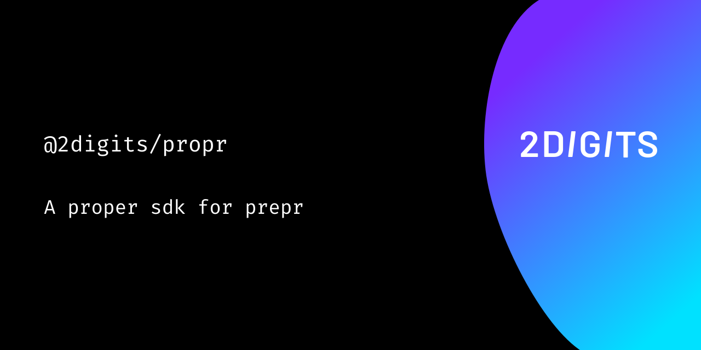

## Installation

To install the package, run:

```bash
pnpm install propr
```

## Usage

To use propr, import the createPreprClient function from the package and call it with the options for your Prepr account:

```typescript
import { createPreprClient } from "propr";

const client = createPreprClient({
  token: "your_token_here",
});
```

Once you have created the client, you can use it to fetch data from Prepr:

```typescript
const articles = await client.fetch("/articles");
```

You can also chain various methods to the client to specify additional options:

```typescript
const articles = await client.sort("publishedAt").limit(10).fetch("/articles");
```

The client also supports GraphQL queries:

```typescript
const query = `query ($slug: String!) {
  article(slug: $slug) {
    id
    title
    publishedAt
  }
}`;

const variables = { slug: "your-article-slug" };

const article = await client
  .graphqlQuery(query)
  .graphqlVariables(variables)
  .fetch();
```

## API

### `createPreprClient(options: PreprClientOptions) => PreprClient`

Creates a new instance of the Prepr client.

#### Options

- token (required): The access token for your Prepr account.
- baseUrl: The base URL for the Prepr API (default: https://cdn.prepr.io).
- timeout: The timeout for API requests, in milliseconds (default: 4000).
- userId: The user ID for A/B testing.

### `PreprClient`

The Prepr client class.

#### Methods

##### `userId(userId: string | number): PreprClient`

Sets the user ID for A/B testing.

##### `timeout(milliseconds: number): PreprClient`

Sets the timeout for API requests, in milliseconds.

##### `sort(field: string): PreprClient`

Sets the field to sort the results by.

##### `limit(limit: number): PreprClient`

Sets the maximum number of results to return.

##### `skip(skip: number): PreprClient`

Sets the number of results to skip.

##### `path(path: string): PreprClient`

Sets the path for the API request.

##### `token(token: string): PreprClient`

Sets the access token for the Prepr account.

##### `graphqlQuery(graphqlQuery: string): PreprClient`

Sets the GraphQL query for the API request.

##### `graphqlVariables(graphqlVariables: object): PreprClient`

Sets the variables for the GraphQL query.

##### `fetch<T = any>(request?: RequestInfo, options?: FetchOptions<"json">): Promise<T>`

Fetches data from the Prepr API.

#### Properties

##### `query: URLSearchParams`

The URL search parameters for the API request.
